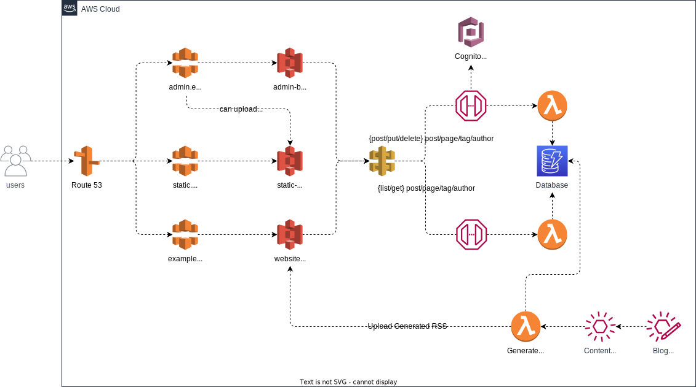

    
    
    

## Serverless Blog
Serverless Blog is an Open Source content platform which makes full benefit of AWS Serverless features.
_(name is subject to change)_

## Architecture

This is the first version of the architecture design which will be updated many, many times during development. This is just a starting point.

## TODO

- Infra:
        - Documentation
    - 100% Test
    - Support without Route53?
    - Feature toggles
        - Enable features when creating main struct and allow turning them on/off
        - Could be used for experimental/alpha features.
    - Thinking points
        - Monitoring
- Back-end
    - Documentation
    - Think about, do want GraphQL?
    - API
        - Endpoints
            - Content
            - Tags
            - Menus
            - Authors?
            - Settings
    - Custom Content Types
        - Extra fields like ACF For Wordpress
    - Thinking points
        - Authentication
            - Support 2FA
            - Support Single Sign On
        - Marketing options
        - Email?
            - Newsletters?

- Important:
    - Customizability
    - Security
    - Availability

- Demo repo
    - Create repository with example website and how to run/deploy etc.

## License

This open-source software is licenced under the [MIT license](./LICENSE).
